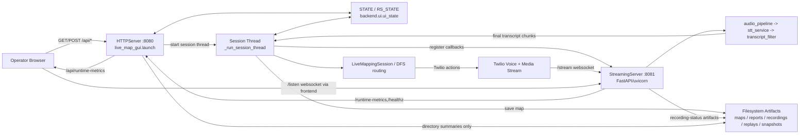
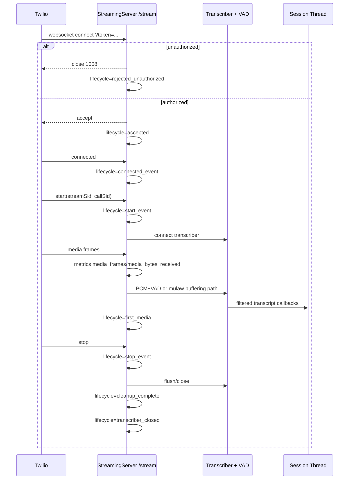
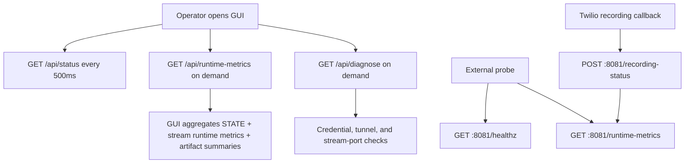

# Bounded Runtime + Replay Architecture Map

Last Updated: 2026-05-10

Purpose: document the current validated runtime topology and operator-visible lifecycle
surfaces without changing behavior, topology, websocket semantics, or replay semantics.

---

## Scope Boundaries

This document describes the runtime exactly as it exists today:

- single OS process
- GUI HTTP server on `127.0.0.1:8080`
- streaming server on `0.0.0.0:8081` in a background thread
- shared in-process state through `STATE`, `RS_STATE`, and `_persistent_stream`
- deterministic hot path preserved as-is

Not covered as implemented behavior:

- no process split
- no websocket protocol changes
- no replay engine redesign
- no new orchestration layer

---

## Topology Snapshot



---

## Startup Ordering

Startup is serialized from `live_map_gui.launch()`:

1. `STATE.begin_startup_trace()` resets bounded startup/runtime chronology for this launch.
2. `launch.begin` runtime checkpoint is recorded.
3. `bootstrap_runtime()` loads `.env` and configures logging.
4. `bootstrap.ready` startup event + runtime checkpoint are recorded.
5. required credential presence is checked and recorded as either:
   - `credentials.ready`
   - `credentials.missing`
6. `_ensure_stream_server()` executes once per process:
   - `stream_server.prepare`
   - `stream_server.start`
   - optional `stream_server.timeout`
   - `stream_server.ready` or `stream_server.error`
7. GUI HTTP server binds `127.0.0.1:8080`.
8. `gui.ready` startup event + runtime checkpoint are recorded.
9. stream URL state is recorded as either:
   - `stream_url.ready`
   - `stream_url.pending`
10. browser is opened and `serve_forever()` begins.

Operational contract:
- the stream server is intended to be warm before the operator starts a session
- startup chronology is bounded and queryable through `/api/runtime-metrics`
- launch ordering does not depend on a successful active call

---

## Runtime Lifecycle

### Session start chronology

`POST /api/start` enters through `mapper_routes.handle_start()`:

1. guard on `STATE.is_running`
2. `STATE.reset()` clears session-visible state and records `state.reset`
3. `STATE.is_running = True`
4. daemon thread starts `_run_session_thread(...)`

### Session thread chronology

`_run_session_thread()` proceeds in this order:

1. `session.thread_start`
2. create `QueuePromptSource`; bind `STATE.source`
3. resolve active stream URL and stream token
4. `session.stream_url_resolved`
5. if stream URL exists:
   - clear old stream callbacks
   - register transcript callback
   - register status callback
   - `session.stream_callbacks_registered`
6. load prior saved map from `map_store`
7. `session.map_loaded`
8. create `TwilioTelephonyClient`
9. create `LiveMappingSession`
10. start background call-status poller once a `session_id` appears
11. execute `session.run()`
12. on clean completion:
   - update `STATE.graph`
   - `session.run_complete`
   - save map
   - `session.map_saved` or `session.map_save_error`
13. on failure:
   - `session.error`
14. finally cleanup:
   - `session.cleanup_begin`
   - clear stream callbacks
   - `session.callbacks_cleared` or `session.callbacks_clear_failed`
   - `session.cleanup_complete`

Operational contract:
- only one mapping session is represented through `STATE` at a time
- the prompt queue is created per session
- callback registration is explicit and torn down explicitly

---

## WebSocket Lifecycle Chronology

`StreamingServer` maintains a bounded lifecycle ring in `_lifecycle_events`.

### `/stream` chronology



### `/listen` chronology

1. token validation matches `/stream`
2. websocket accepted
3. listener count increments
4. raw μ-law bytes from `/stream` are broadcast to listeners
5. idle timeouts are counted but do not change protocol shape
6. disconnect/error is recorded with close code and reason

Operational contract:
- `/listen` is observational only; it does not feed control back into the hot path
- `/stream` owns media ingress, STT hookup, and lifecycle metrics
- auth token agreement is deterministic from environment unless explicitly overridden

---

## Transcript and Media-Flow Boundaries

Current runtime boundary chain:

```text
Twilio μ-law media frames
→ StreamingServer._handle_stream()
→ audio_pipeline.process_audio_frame() / VoiceActivityDetector (PCM path only)
→ stt_service.create_transcriber() or Deepgram fallback
→ TranscriptFilter
→ session transcript callback in _run_session_thread()
→ QueuePromptSource.prompt_queue
→ LiveMappingSession / DFS routing
→ TwilioTelephonyClient actions
```

Boundary notes:

- raw media stays inside `streaming_server.py`
- transcript dedup/filtering ends before session queue insertion
- `STATE.live_caption` is a UI-facing transient, not authoritative replay state
- `/listen` receives raw audio copies only; it is outside routing decisions
- prompt queue insertion happens only after transcript chunk assembly/finalization in the session callback

---

## Queue and Checkpoint Semantics

### Prompt queue

`QueuePromptSource.prompt_queue` is an `ObservableQueue` with these semantics:

- FIFO queue
- unbounded queue size by implementation
- per-session lifetime
- metrics captured on every `put()` and `get()`:
  - `current_depth`
  - `puts_total`
  - `gets_total`
  - `max_depth_seen`
  - `last_put_at`
  - `last_get_at`
  - `elapsed_ms` from session-local start

Queue usage paths:
- transcript callback enqueues joined user utterances
- `/api/prompt` can enqueue manual text
- `/api/end` enqueues `None` sentinel

### Runtime checkpoints

`AppState.runtime_checkpoints` is a bounded ring buffer with max 64 entries.
Each checkpoint includes:

- `seq`
- `launch_sequence`
- `category`
- `stage`
- `detail`
- `t_ms`
- wall-clock `ts`
- any stage-specific extras

Categories observed today:
- `startup`
- `session`
- `state`
- `cleanup`
- default `runtime` is available but not the dominant current path

Operational contract:
- checkpoints are launch-scoped
- reset accounting survives `STATE.reset()` via `reset_count` and `last_reset_at`
- chronology is bounded for inspection, not durable persistence

---

## Replay Artifact Lifecycle

There are two distinct replay-related surfaces today.

### 1. CLI replay path (`replay_mode.py`)

1. load JSON trace via `load_trace()` or accept in-memory events
2. parse into `CallEvent` list
3. feed `EventLedger`
4. feed `IvrMapper.observe(...)` with fixed `branch_confidence=0.8`
5. build text report
6. return `ReplayResult`

Current contract:
- replay is deterministic for the provided event sequence
- replay is in-memory by default
- CLI echoes the report; it does not automatically persist into `REPLAYS_DIR`

### 2. Runtime replay visibility surface (`/api/runtime-metrics`)

`replay_visibility` reports:
- configured reports directory summary
- configured recordings directory summary
- `REPLAYS_DIR` summary
- `SNAPSHOTS_DIR` summary
- whether recording-status callback is configured
- latest recording artifact statuses remembered by `StreamingServer`

Current contract:
- runtime metrics expose directory visibility only
- mapping sessions save maps to `~/.ivr_maps`, not `REPLAYS_DIR`
- snapshots and replays are visible as directories but are not populated by the live-map runtime shown here

### Recording artifact chronology

Twilio recording callback flow:

1. `POST /recording-status`
2. ignore non-`completed` states
3. remember queued recording artifact
4. async download `.wav`
5. remember `downloaded` or `download_failed`
6. Whisper transcription in executor
7. remember `transcribed`, `transcriber_missing`, or `transcription_failed`
8. surface statuses through stream runtime metrics and status callbacks

---

## Runtime Metrics Inventory

### GUI surface: `GET /api/runtime-metrics`

Top-level sections:
- `startup`
- `runtime`
- `session`
- `stream_server`
- `replay_visibility`
- `staleness`

### `startup`
- startup event count
- startup event chronology

### `runtime`
- launch sequence
- checkpoint count
- cleanup count
- reset count
- last reset time
- last checkpoint
- checkpoint chronology

### `session`
- `is_running`
- current `target`
- elapsed session ms
- ledger event count
- prompt queue metrics
- current session error

### `stream_server`
- uptime / active streams / listen clients
- auth-token configured flag
- idle timeout counters
- connection/disconnection timestamps
- disconnect reasons / close codes
- callback registration and cleanup counters
- last status message / last error
- websocket lifecycle ring buffer
- last stream metrics payload
- remembered recording artifacts

### `last_stream_metrics` inventory
- stream sequence / start time / backend
- stream status / last event / disconnect reason / close code
- media frame and byte counters
- first media timing and VAD timings when applicable
- audio buffer overflow counter
- transcriber stats
- transcript filter stats
- VAD stats
- stream duration

Operational contract:
- metrics are observational snapshots, not transactional state
- metrics combine GUI-owned and stream-owned surfaces without changing call flow

---

## Cleanup Sequencing

### Session cleanup

Session cleanup is deterministic in the `finally` block of `_run_session_thread()`:

1. `session.cleanup_begin`
2. `STATE.is_running = False`
3. `STATE.session = None`
4. clear stream callbacks if stream server exists
5. `session.callbacks_cleared` or `session.callbacks_clear_failed`
6. `session.cleanup_complete`

What is not reset here:
- `STATE.source` remains available long enough for final queue metrics emission
- runtime checkpoint chronology remains queryable after session end
- stream server process/thread remains warm for subsequent sessions

### Process shutdown cleanup

On GUI `KeyboardInterrupt`:
- `shutdown.requested` startup event
- `shutdown.requested` cleanup checkpoint
- GUI server exits

No broader teardown orchestration is currently documented in `launch()` for the stream server thread beyond process exit.

---

## Stale-Runtime Detection Flow

`_staleness_payload()` computes staleness from the newest known activity timestamp across:

- latest startup event
- latest runtime checkpoint
- last listen connect/disconnect times
- last stream connect/disconnect times
- remembered recording artifact update times

Then:

1. compute `idle_for_s`
2. read threshold from `RUNTIME_STALE_AFTER_S` (default `300`)
3. declare stale only when all are true:
   - `idle_for_s >= stale_after_s`
   - `STATE.is_running` is false
   - `active_streams == 0`
   - `listen_clients == 0`

Operational contract:
- stale detection is conservative
- active call/session/listener presence suppresses stale classification
- stale detection is based on observed timestamps, not heartbeats

---

## Operational Probe Flow



Probe roles:

- `/api/status`: operator timeline, graph, live caption, session flags
- `/api/runtime-metrics`: lifecycle chronology, checkpoint history, stream metrics, artifact visibility, stale detection
- `/api/diagnose`: startup dependency and tunnel readiness checks
- `:8081/healthz`: minimal liveness/readiness snapshot for stream server
- `:8081/runtime-metrics`: raw stream-server metrics without GUI aggregation

---

## Current Runtime Contracts Documented

Preserved contracts now explicitly mapped:

- single-process, dual-port topology
- startup occurs before any active mapping session
- session execution is thread-based and bounded by explicit cleanup hooks
- websocket auth uses one deterministic token scheme for both `/stream` and `/listen`
- transcript delivery crosses into routing only through explicit callbacks and the prompt queue
- runtime chronology is bounded in memory, not durably journaled
- replay execution is deterministic and currently separate from live runtime artifact production
- stale-runtime detection is observational and non-invasive

---

## Remaining Operational Blind Spots

These are documentation-visible gaps in the current topology, not redesign proposals:

1. `REPLAYS_DIR` and `SNAPSHOTS_DIR` are exposed in metrics, but this live runtime path does not currently write replay or snapshot artifacts.
2. map persistence lives in `~/.ivr_maps` via `map_store.py`, outside the `ui_state.py` storage constants family surfaced in runtime metrics.
3. GUI shutdown records intent, but stream-server thread teardown is not separately surfaced as a post-shutdown lifecycle event.
4. `/api/status` log draining is operationally useful but ephemeral; drained logs are not preserved in runtime checkpoints.
5. per-session queue semantics are visible, but queue wait-time/latency histograms are not surfaced.
6. transcript callback assembly state (`_utterance["chunks"]`) is runtime-local and not externally inspectable.

These blind spots should be treated as current-state notes only; no behavior changes are implied by this document.
