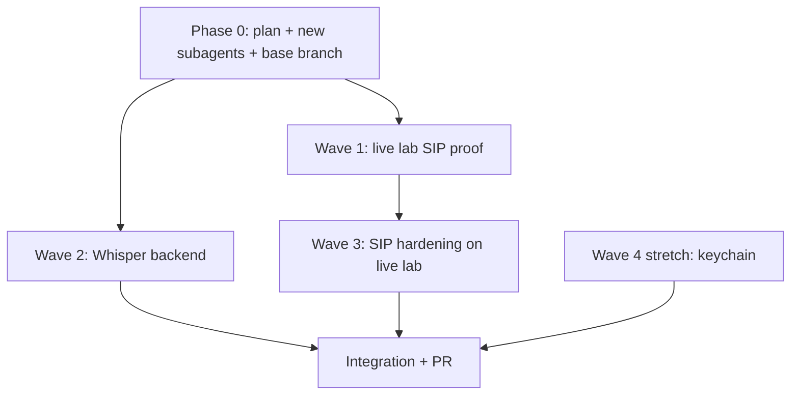

# Desktop live lab + Whisper backend + SIP hardening

## Goal
The rsiprtp desktop loop is merged and unit-proven. This phase makes it actually run: prove the SIP
bridge against a live lab Asterisk, give the STT pipeline a real on-device Whisper backend, and
harden the bridge against real-world call failures. Privacy contract from
`docs/architecture-boundary.md` and `client-native/README.md` still holds — nothing leaves the device.

## Environment reality
This CI/VM is headless Linux: no display for the Tauri GUI, and no bundled Whisper model. Docker can
be installed here, so the **lab Asterisk + a headless SIP integration test** are feasible; the full
Tauri GUI Run and real model transcription remain macOS-host tasks. Each wave marks proven-here vs.
deferred-to-macOS explicitly.

## Waves and owning subagents

### Wave 1 - Live lab SIP proof (test "step 2")  [subagent: desktop-lab-live]
- Install Docker (docker-in-docker), generate lab TLS creds, bring up Asterisk via
  `docker compose --profile lab` + the API.
- Add a headless Rust integration test in `desktop/src-tauri/` that drives the `sip_bridge.rs` dial
  path against the live lab (INVITE ext 1000 over TLS -> answer -> send DTMF -> receive RTP/PCM),
  asserting the transport events + media. Run it and report honestly how far it gets.
- Owns: `desktop/src-tauri/tests/**`, `scripts/lab-live-test.sh`. Must NOT change the frozen
  `sip_bridge.rs` public behavior or client contracts (may add `#[cfg(test)]`-only hooks if needed).

### Wave 2 - On-device Whisper backend  [subagent: desktop-whisper-bridge]
- Implement a Rust whisper.cpp binding in the Tauri shell that injects `window.__pathlineWhisper`
  with `transcribe(pcm, sampleRate) -> text`, mirroring the SIP bridge injection in `lib.rs`.
- Model handling: load a small model (tiny/base) from a configured local path; document
  download-vs-bundle. No network transcription, ever.
- Verify against the existing `client/src/stt/whisperEngine.ts` capability probe + `stt:fixture`.
- Owns: `desktop/src-tauri/src/whisper_bridge.rs`, `lib.rs` injection (whisper only),
  `Cargo.toml` (whisper deps). Must NOT edit `client/src/stt/**` engine logic or SIP files.

### Wave 3 - SIP hardening / failure matrix  [subagent: desktop-sip-harden]
- Implement the plan's failure matrix in `sip_bridge.rs`: RTP timeout / call drop ->
  `disconnected` + clean `CALL_ENDED`; bad creds / unreachable -> `error` (already fails closed,
  validate live); basic reconnect/retry; symmetric-RTP/NAT behavior against a non-loopback peer.
- Validate against the Wave 1 live lab. Owns: `desktop/src-tauri/src/sip_bridge.rs` + its tests.

### Wave 4 (stretch) - Secrets in OS keychain  [subagent: desktop-secrets-keychain]
- Store run secrets in the OS keychain (macOS Keychain / libsecret) via a Tauri command so the
  desktop honors the "secrets in secure enclave" clause of `client-native/README.md`.
- Owns: `desktop/src-tauri/src/secrets.rs` + minimal client hook. Must NOT weaken the API contract.

### Integration
Merge waves into `cursor/desktop-next-0880`; green `client` build + `cargo test` + `stt:fixture`;
finalize PR to `main` with a proven-vs-deferred checklist.

## Sequencing

## Verification gates
- `cd client && npm run build` green; `npm run stt:fixture` PASS.
- `cd desktop/src-tauri && cargo test` (unit + new live/integration tests) reported.
- Lab: `docker compose --profile lab` up; Asterisk receives INVITE for ext 1000; DTMF advances IVR.
- Privacy: no audio/transcript egress; callstate encrypted blob + nonce; DTMF ledger hash only.
- Honest proven-here vs. deferred-to-macOS notes per wave.

## Out of scope
Mobile CallKit/Telecom, server-mediated calls, production SIP-trunk/DID selection, app store
signing/notarization.
