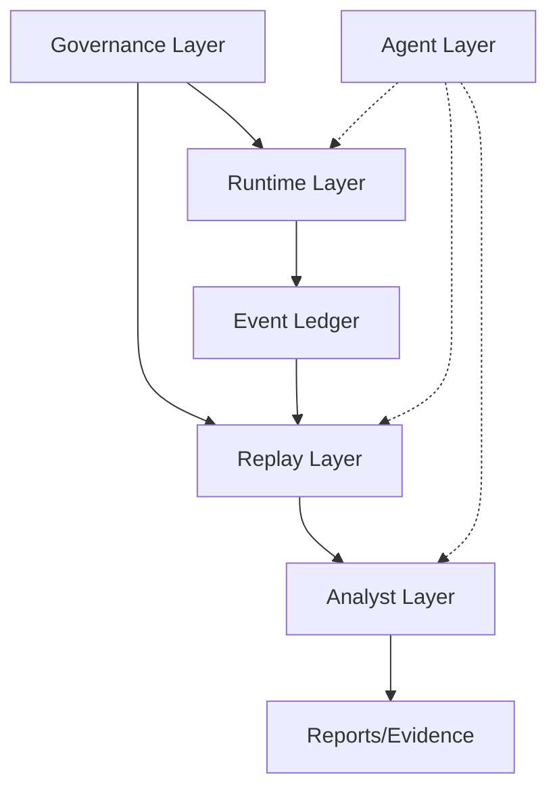

# Pathline System Topology

## Layer Dependencies
The system follows a strict hierarchy. Downstream layers depend on upstream layers, but upstream layers must not depend on downstream layers for core logic.

## Forbidden Mutations
- **Analyst -> Runtime:** The Analyst Layer (UI) may never directly mutate the Runtime Layer's core state without going through the defined API and EventBus.
- **AI -> Replay:** AI agents may annotate or summarize replays but must NEVER mutate the underlying source event logs.
- **UI -> Events:** The frontend must never rewrite or delete events from the append-only ledger.
- **Replay -> Runtime:** Replay is observational; it must never feed state back into a live runtime session.

## Component Boundaries
### Runtime
- Lifecycle: `runtime/sessions`
- State: `runtime/state`
- Transport: `runtime/transport`
- Media: `runtime/media`
- Telemetry: `runtime/telemetry`

### Replay
- Timelines: `replay/timelines`
- Reducers: `replay/reducers`
- Snapshots: `replay/snapshots`
- Media Sync: `replay/media_sync`
